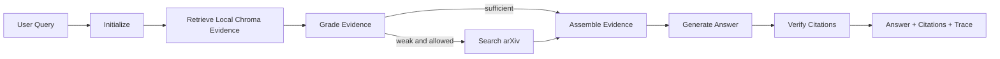

# EduPaper Agent

> 面向教育学研究者与研究生的可追溯论文研读 Agent：上传 PDF，构建本地向量知识库，在证据不足时检索 arXiv，并生成带引用、可复盘的回答或文献综述。

[](https://www.python.org/)
[](https://fastapi.tiangolo.com/)
[](https://github.com/langchain-ai/langgraph)
[](LICENSE)

EduPaper Agent 参考 [AgentGuide 的 Paper Agent 项目设计](https://github.com/adongwanai/AgentGuide/tree/main/projects/01-paper-agent)，代码为独立实现。项目重点不是“让大模型总结 PDF”，而是把文档解析、向量检索、检索质量判断、补充搜索、证据编号、答案核验、trace 和 eval 组成一个可运行、可解释的 Agent 工程。

## 功能

- **多引擎 PDF 入库**：原生 PDF 使用 PyMuPDF；扫描件与复杂版面可自动切换 MinerU 或 PaddleOCR PP-StructureV3，并保留页码、解析器和 chunk 元数据。
- **离线向量检索**：Chroma + 字符 n-gram Hashing Embedding，无 API Key、无模型下载也能运行。
- **LangGraph 工作流**：本地检索 → 证据判断 → 可选 arXiv 检索 → 证据组装 → 生成 → 引用检查。
- **OpenAI 兼容接口**：可连接 OpenAI、DeepSeek 或其他兼容 `/chat/completions` 的服务。
- **三种回答模式**：普通问答、结构化综述、多论文比较。
- **可追溯引用**：本地证据使用 `L1/L2...`，arXiv 摘要使用 `A1/A2...`。
- **文档管理**：SHA-256 去重、列表查询、按文档删除、限定文档范围检索。
- **Observability**：每次执行返回节点 trace，并保存为 `data/runs/<run-id>.json`。
- **可运行界面**：根路径提供轻量 Web UI，另有 Swagger API 文档。
- **测试与评测**：pytest、Ruff、GitHub Actions 和基础 eval harness。

## Agent 工作流



## 技术栈

| 层 | 技术 |
|---|---|
| Agent orchestration | LangGraph |
| API / UI | FastAPI + Vanilla HTML/JS |
| Vector database | Chroma |
| Local embedding | scikit-learn HashingVectorizer |
| PDF parsing | PyMuPDF + MinerU CLI + PaddleOCR PP-StructureV3 |
| External paper search | arXiv API |
| LLM | OpenAI-compatible Chat Completions |
| Metadata / registry | SQLite |
| Quality | pytest, Ruff, GitHub Actions |

## 快速开始

### 1. 安装

```bash
git clone https://github.com/Alankyleee/EduPaper-Agent.git
cd EduPaper-Agent
python -m venv .venv
```

激活环境：

```bash
# macOS / Linux
source .venv/bin/activate

# Windows PowerShell
.venv\Scripts\Activate.ps1
```

安装基础依赖并准备环境变量：

```bash
pip install -e ".[dev]"
cp .env.example .env
```

基础安装包含 PyMuPDF，适合带文本层的普通 PDF。扫描件或复杂论文版面可选择安装一个解析引擎：

```bash
# 方案 A：MinerU，适合论文、多栏、表格和公式；安装体积较大
pip install -e ".[mineru]"

# 方案 B：PaddleOCR PP-StructureV3，适合扫描件 OCR 和版面恢复
pip install -e ".[paddleocr]"
# 还需按 PaddleOCR 官方说明安装与你的系统/硬件匹配的推理引擎

# 同时安装两个可选解析器
pip install -e ".[parsers]"
```

`PDF_PARSER=auto` 时，系统先尝试 PyMuPDF；原生文本不足时，依次尝试 `PDF_FALLBACK_ORDER=mineru,paddleocr`。也可以在上传接口中显式选择解析器。

不配置模型 API 也可以启动，系统会返回检索证据摘要。要生成完整的综合回答，在 `.env` 中配置：

```env
OPENAI_API_KEY=your-key
OPENAI_BASE_URL=
MODEL_NAME=gpt-4o-mini
```

对于兼容 OpenAI Chat Completions 的服务，填写对应 `OPENAI_BASE_URL` 和模型名即可。

### 2. 启动

```bash
python start.py
```

访问：

- Web UI：`http://127.0.0.1:8000/`
- Swagger：`http://127.0.0.1:8000/docs`
- 健康检查：`http://127.0.0.1:8000/health`

### 3. Docker

```bash
cp .env.example .env
docker compose up --build
```

## API 示例

### 上传论文

```bash
curl -X POST "http://127.0.0.1:8000/v1/documents/upload?parser=auto" \
  -F "file=@paper.pdf"
```

可选 `parser`：`auto`、`pymupdf`、`mineru`、`paddleocr`。显式指定可用于固定本次入库所采用的解析引擎。

### 查看已入库文档

```bash
curl http://127.0.0.1:8000/v1/documents
```

### 论文问答

```bash
curl -X POST http://127.0.0.1:8000/v1/agent/query \
  -H "Content-Type: application/json" \
  -d '{
    "query": "概括研究问题、研究方法、样本、主要发现和局限。",
    "mode": "review",
    "top_k": 6,
    "allow_arxiv_search": false
  }'
```

限定在某些文档中检索：

```json
{
  "query": "两篇论文的方法设计有哪些差异？",
  "mode": "compare",
  "document_ids": ["document-id-1", "document-id-2"],
  "allow_arxiv_search": false
}
```

响应中包含：

```json
{
  "run_id": "...",
  "answer": "... [L1]",
  "citations": [
    {
      "citation_id": "L1",
      "source": "paper.pdf",
      "page": 3,
      "snippet": "...",
      "score": 0.71
    }
  ],
  "used_arxiv": false,
  "warnings": [],
  "trace": [
    {"node": "retrieve_local", "detail": {"count": 6, "best_score": 0.71}}
  ]
}
```

## 项目结构

```text
EduPaper-Agent/
├── edupaper_agent/
│   ├── agent.py           # LangGraph 节点和路由
│   ├── api.py             # FastAPI 路由和 Web UI
│   ├── services.py        # 文档入库、查询和运行记录
│   ├── storage.py         # Chroma 检索
│   ├── embeddings.py      # 离线 Hashing Embedding
│   ├── registry.py        # SQLite 文档注册表
│   ├── pdf.py             # PyMuPDF / MinerU / PaddleOCR 解析、自动降级和切分
│   ├── arxiv_client.py    # arXiv 工具
│   ├── llm.py             # OpenAI 兼容模型调用
│   └── static/index.html  # 简单演示页面
├── tests/                 # 单元与 API 测试
├── eval/                  # 评测用例和运行脚本
├── docs/                  # 架构与评测设计
├── scripts/               # 示例 PDF 生成脚本
├── Dockerfile
├── docker-compose.yml
└── langgraph.json         # LangGraph Studio 配置
```

## 测试与代码质量

```bash
ruff check .
pytest
```

生成一个可测试的示例 PDF：

```bash
python scripts/make_sample_pdf.py
```

运行基础评测：

```bash
python eval/run_eval.py
```

基础 eval 仅用于验证管线。建议扩展到不少于 20 条人工标注用例，并人工核验引用是否真正支持答案。详见 [`docs/eval.md`](docs/eval.md)。

## 设计说明

### PDF 解析器如何选择？

默认采用 `auto` 策略：

1. 使用 PyMuPDF 快速提取原生文本；
2. 根据每页有效字符数和页面覆盖率判断文本层是否可用；
3. 文本不足时优先调用 MinerU CLI，读取带 `page_idx` 的 `content_list.json`，保留标题、正文、表格、公式、列表和图表说明；
4. MinerU 不可用或失败时调用 PaddleOCR `PPStructureV3`，使用每页 `markdown_texts` 作为检索文本；
5. 两个 OCR/版面解析器均不可用时，若 PyMuPDF 仍有少量文本则带 warning 降级，否则明确报错。

解析器是可选重依赖，不放进默认 Docker 镜像。部署时建议把 MinerU 或 PaddleOCR 做成独立解析服务，避免占用 Agent API 进程的内存。

### 为什么不默认下载大型 Embedding 模型？

项目使用字符 n-gram Hashing Embedding，确保第一次 clone 后无需下载模型即可完成中文和英文的基本检索。它适合 MVP、测试和演示，但质量不等于专业语义模型。生产环境可以替换为 BGE、OpenAI Embeddings 或其他模型；`ChromaStore` 的接口无需改变。

### 为什么 arXiv 只作为补充证据？

本地论文应该优先于开放检索结果。Agent 只有在本地检索分数和字符重合度都较低时，才会调用 arXiv；用户也可以完全关闭外部搜索。

### 如何避免“看起来有引用，但引用不支持结论”？

当前版本保证来源编号和原始证据片段可追溯，并在正文缺少引用编号时返回 warning。真正的 citation precision 仍需要人工标注评测，不能只靠格式检查。下一步可加入 LLM-as-judge 与人工抽检结合的引用支持度评估。

## Roadmap

- [ ] 接入 Semantic Scholar / OpenAlex，多源去重和引用网络扩展。
- [x] 接入 MinerU 与 PaddleOCR PP-StructureV3，支持扫描件、表格、公式和复杂版面自动降级解析。
- [ ] 加入跨编码器 reranker，并完成检索消融实验。
- [ ] 输出 Markdown 综述、BibTeX、comparison.csv 和 evidence.jsonl。
- [ ] 加入 SQLite 长期研究笔记和主题级 memory。
- [ ] 加入 Prompt Injection 测试、成本上限和模型 fallback。
- [ ] 用 LangSmith 或 OpenTelemetry 展示节点级 latency 与 token 消耗。

## 致谢

项目思路参考：

- [AgentGuide / Paper Agent](https://github.com/adongwanai/AgentGuide/tree/main/projects/01-paper-agent)
- [LangGraph](https://github.com/langchain-ai/langgraph)
- [Chroma](https://github.com/chroma-core/chroma)
- [MinerU](https://github.com/opendatalab/MinerU)
- [PaddleOCR](https://github.com/PaddlePaddle/PaddleOCR)

## License

MIT License. See [LICENSE](LICENSE).
