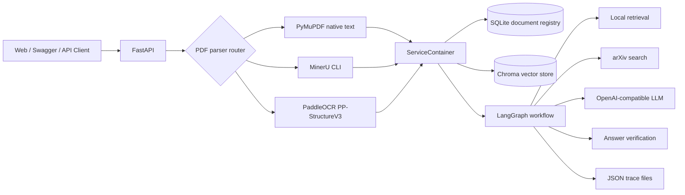

# Architecture

## PDF parser routing

`PDF_PARSER=auto` uses a fast-to-accurate fallback chain:

1. PyMuPDF extracts native text and preserves page boundaries.
2. A text-density gate checks total effective characters and page coverage.
3. Sparse or image-only PDFs are sent to the configured fallback order, normally MinerU then PaddleOCR.
4. MinerU is invoked through its CLI and the parser consumes `*_content_list.json`, grouping blocks by the 0-based `page_idx` field.
5. PaddleOCR uses `PPStructureV3.predict()` and consumes each page's `markdown.markdown_texts` output.
6. Every Chroma chunk records `source`, `page`, `chunk_index`, `document_id`, and `parser`.

The optional OCR/layout dependencies are lazily imported or invoked. The base service remains runnable with PyMuPDF only.

## Agent nodes

1. `initialize`: allocates a run ID and initializes trace state.
2. `retrieve_local`: searches Chroma, optionally filtered by selected document IDs.
3. `grade_local_evidence`: combines vector score and character overlap to decide whether evidence is weak.
4. `search_arxiv`: retrieves paper metadata and abstracts only when needed and allowed.
5. `assemble_evidence`: assigns stable citation IDs (`L*` and `A*`).
6. `generate_answer`: uses an OpenAI-compatible model or an offline extractive fallback.
7. `verify_answer`: checks citation presence and exposes warnings instead of hiding failures.

## Reliability choices

- Uploaded files are size-limited and filenames are sanitized.
- Duplicate PDFs are detected by SHA-256.
- The selected parser and page metadata are persisted for reproducibility.
- Parser failures are explicit; `auto` mode reports fallback warnings instead of silently hiding them.
- MinerU is executed with a timeout and stderr capture.
- Local retrieval works without an embedding API or model download.
- Each run is saved under `data/runs/<run-id>.json` for replay and debugging.
- External arXiv errors are returned as warnings rather than silently ignored.
